# Thunder Messaging Framework - UML Class Diagram

```plantuml
@startuml Thunder_Messaging_Framework
!theme plain
skinparam linetype ortho
skinparam classAttributeIconSize 0
skinparam classFontStyle bold

title Thunder Messaging Framework - Class Diagram

' ============================================
' Core Messaging Infrastructure (Source/core)
' ============================================
package "Core::Messaging" #LightBlue {
    
    enum "Metadata::type" as MetadataType {
        INVALID
        TRACING
        LOGGING
        REPORTING
        OPERATIONAL_STREAM
        ASSERT
        TELEMETRY
    }
    
    enum OutputMode {
        HANDLER
        DIRECT
        ALL
    }
    
    interface IEvent {
        +Serialize(buffer: uint8_t[], length: uint16_t): uint16_t
        +Deserialize(buffer: uint8_t[], length: uint16_t): uint16_t
        +Data(): string
    }
    
    class Metadata {
        -_type: type
        -_category: string
        -_module: string
        +Type(): type
        +Module(): string
        +Category(): string
        +Serialize(): uint16_t
        +Deserialize(): uint16_t
    }
    
    class MessageInfo {
        -_timeStamp: uint64_t
        +TimeStamp(): uint64_t
        +ToString(abbreviate): string
    }
    
    interface IControl {
        +Enable(enable: bool): void
        +Enable(): bool
        +Routing(mode: OutputMode): void
        +Routing(): OutputMode
        +Destroy(): void
        +Metadata(): Metadata
        +{static} Announce(control: IControl*): void
        +{static} Revoke(control: IControl*): void
        +{static} Iterate(handler: IHandler&): void
    }
    
    interface IStore {
    }
    
    class "IStore::Tracing" as Tracing {
        -_fileName: string
        -_lineNumber: uint16_t
        -_className: string
        +FileName(): string
        +LineNumber(): uint16_t
        +ClassName(): string
    }
    
    class "IStore::Logging" as Logging {
    }
    
    class "IStore::WarningReporting" as WarningReportingStore {
        -_callsign: string
        +Callsign(): string
    }
    
    class "IStore::OperationalStream" as OperationalStream {
    }
    
    class "IStore::Assert" as Assert {
        -_processId: pid_t
        -_processName: string
        -_fileName: string
        -_lineNumber: uint16_t
        -_callstack: string
        +ProcessId(): pid_t
        +ProcessName(): string
        +FileName(): string
        +LineNumber(): uint16_t
        +Callstack(): string
    }
    
    class TextMessage {
        -_text: string
        +Data(): string
    }
    
    class TelemetryMessage {
        -_type: ValueType
        -_text: string
        +Type(): ValueType
        +Data(): string
    }
    
    class "BaseCategoryType<TYPE>" as BaseCategoryType {
        -_text: string
        +Data(): char*
        +Length(): uint16_t
    }
}

' ============================================
' Warning Reporting (Source/core)
' ============================================
package "WarningReporting" #LightGreen {
    
    interface IWarningEvent {
        +Category(): char*
        +Routing(): OutputMode
        +Serialize(buffer: uint8_t[], length: uint16_t): uint16_t
        +Deserialize(buffer: uint8_t[], length: uint16_t): uint16_t
        +ToString(text: string&): void
        +IsWarning(): bool
    }
    
    interface IWarningReportingUnit {
        +ReportWarningEvent(identifier: char[], information: IWarningEvent&): void
        +FetchCategoryInformation(category: string, ...): void
        +AddToCategoryList(category: IWarningReportingControl&): void
        +RemoveFromCategoryList(category: IWarningReportingControl&): void
    }
    
    interface IWarningReportingControl {
        +Exclude(toExclude: string): void
        +Configure(setting: string): void
        +Clone(): IWarningEvent*
    }
    
    class WarningReportingUnitProxy <<Singleton>> {
        -_handler: IWarningReportingUnit*
        -_waitingAnnounces: vector<IWarningReportingControl*>
        -_adminLock: CriticalSection*
        +{static} Instance(): WarningReportingUnitProxy&
        +ReportWarningEvent(identifier: char[], info: IWarningEvent&): void
        +Handle(handler: IWarningReportingUnit*): void
        +FetchCategoryInformation(...): void
    }
    
    class "WarningReportingType<CATEGORY>" as WarningReportingType {
        -_info: CATEGORY
        +Analyze(modulename: char[], identifier: char[], args...): bool
        +{static} IsEnabled(): bool
        +Category(): char*
        +Serialize(): uint16_t
        +Deserialize(): uint16_t
        +ToString(text: string&): void
        +IsWarning(): bool
    }
    
    class "WarningReportingType::WarningReportingControl<CONTROLCATEGORY>" as WarningReportingControl {
        -_categoryName: string
        -_enabled: uint8_t
        -_outputMode: OutputMode
        -_excludedWarnings: ExcludedWarnings
        -_metadata: Metadata
        +IsEnabled(): bool
        +IsCallsignExcluded(callsign: string): bool
        +IsModuleExcluded(module: string): bool
        +Clone(): IWarningEvent*
        +Enable(): bool
        +Enable(enabled: bool): void
        +Routing(): OutputMode
        +Routing(mode: OutputMode): void
        +Exclude(toExclude: string): void
        +Configure(settings: string): void
        +Destroy(): void
        +Metadata(): Metadata
    }
    
    class WarningReportingUnit <<Singleton>> {
        -_categories: ControlList
        -_enabledCategories: Settings
        -_adminLock: CriticalSection
        +{static} Instance(): WarningReportingUnit&
        +ReportWarningEvent(identifier: char[], information: IWarningEvent&): void
        +FetchCategoryInformation(category: string, ...): void
        +AddToCategoryList(category: IWarningReportingControl&): void
        +RemoveFromCategoryList(category: IWarningReportingControl&): void
        +GetCategories(): list<string>
        +Defaults(): string
        +Defaults(jsonCategories: string): void
        +Clone(categoryName: string): IWarningEvent*
    }
    
    class "WarningReportingUnit::Setting" as WRUSetting {
        -_category: string
        -_enabled: bool
        -_excluded: string
        -_categoryconfig: string
        +Category(): string
        +Enabled(): bool
        +Excluded(): string
        +Configuration(): string
    }
    
    class "WarningReportingBoundsCategory<CONTROLCATEGORY>" as WarningReportingBoundsCategory {
        -_category: CONTROLCATEGORY
        -_actualValue: uint32_t
        -{static} _reportingBound: atomic<uint32_t>
        -{static} _warningBound: atomic<uint32_t>
        +Analyze(moduleName: char[], identifier: char[], actualValue: uint32_t, args...): bool
        +{static} Configure(settings: string): void
        +{static} CategoryName(): string
    }
    
    class ExcludedWarnings {
        -_callsigns: unordered_set<string>
        -_modules: unordered_set<string>
        +IsCallsignExcluded(callsign: string): bool
        +IsModuleExcluded(module: string): bool
        +InsertCallsign(callsign: string): void
        +InsertModule(module: string): void
    }
}

' ============================================
' Messaging Library (Source/messaging)
' ============================================
package "Messaging" #LightYellow {
    
    class MessageUnit <<Singleton>> {
        +{static} Instance(): MessageUnit&
        +Push(metadata: MessageInfo&, message: IEvent*, mode: OutputMode): void
        +Open(identifier: string, ...): uint32_t
        +Close(): void
    }
    
    class "ControlType<CATEGORY, MODULENAME, TYPE>" as ControlType {
        -_enabled: uint8_t
        -_outputMode: OutputMode
        -_metaData: Metadata
        +IsEnabled(): bool
        +Enable(enabled: bool): void
        +Routing(): OutputMode
        +Routing(mode: OutputMode): void
        +Metadata(): Metadata
    }
    
    class "LocalLifetimeType<CATEGORY, MODULENAME, TYPE>" as LocalLifetimeType {
        -{static} _control: ControlType
        +{static} IsEnabled(): bool
        +{static} Enable(enable: bool): void
        +{static} Metadata(): Metadata
        +{static} Routing(): OutputMode
        +{static} Announce(): void
    }
    
    interface IEventFactory {
        +GetMetadata(): ProxyType<MessageInfo>
        +GetMessage(): ProxyType<IEvent>
    }
    
    class "TraceFactoryType<METADATA, EVENT>" as TraceFactoryType {
        -_eventPool: ProxyPoolType<EVENT>
        -_metadataPool: ProxyPoolType<METADATA>
        +GetMetadata(): ProxyType<MessageInfo>
        +GetMessage(): ProxyType<IEvent>
    }
    
    class Control {
        -_enabled: OptionalType<bool>
        -_routing: OptionalType<OutputMode>
        +Enabled(): OptionalType<bool>
        +Routing(): OptionalType<OutputMode>
        +SetEnabled(enabled: bool): void
        +SetRouting(routing: OutputMode): void
    }
}

' ============================================
' Assertion (Source/core)
' ============================================
package "Assertion" #LightPink {
    
    interface IAssertionUnit {
    }
    
    class AssertionUnitProxy <<Singleton>> {
        -_handler: IAssertionUnit*
        -_adminLock: CriticalSection*
        +{static} Instance(): AssertionUnitProxy&
        +Handle(handler: IAssertionUnit*): void
        +AssertionEvent(metadata: Assert&, message: TextMessage&, mode: OutputMode): void
    }
    
    class BaseAssertType {
        +{static} IsEnabled(): bool
        +{static} Enable(enable: bool): void
        +{static} Metadata(): Metadata
        +{static} Routing(): OutputMode
    }
    
    class AssertionControl {
        -_categoryName: string
        -_enabled: uint8_t
        -_outputMode: OutputMode
        -_metadata: Metadata
        +IsEnabled(): bool
        +Enable(enabled: bool): void
        +Routing(): OutputMode
        +Routing(mode: OutputMode): void
    }
}

' ============================================
' Trace Categories (Source/messaging)
' ============================================
package "Trace" #LightCyan {
    class "Text" as TraceText
    class "Initialisation" as TraceInitialisation
    class "Information" as TraceInformation
    class "Warning" as TraceWarning
    class "Error" as TraceError
    class "Fatal" as TraceFatal
    class "Duration" as TraceDuration
    class "MethodEntry" as TraceMethodEntry
    class "MethodExit" as TraceMethodExit
}

' ============================================
' Logging Categories (Source/messaging)
' ============================================
package "Logging" #Wheat {
    class "Startup" as LogStartup
    class "Shutdown" as LogShutdown
    class "Notification" as LogNotification
    class "Error" as LogError
    class "ParsingError" as LogParsingError
    class "Fatal" as LogFatal
    class "Crash" as LogCrash
}

' ============================================
' OperationalStream Categories
' ============================================
package "OperationalStream" #Lavender {
    class "BaseOperationalType<CATEGORY>" as BaseOperationalType {
        +{static} IsEnabled(): bool
        +{static} Instance(): Control&
        +{static} Enable(enable: bool): void
        +{static} Metadata(): Metadata
    }
    class StandardOut
    class StandardError
}

' ============================================
' Inheritance Relationships
' ============================================
MessageInfo --|> Metadata
Tracing --|> MessageInfo
Logging --|> MessageInfo
WarningReportingStore --|> MessageInfo
OperationalStream --|> MessageInfo
Assert --|> MessageInfo

TextMessage ..|> IEvent
TelemetryMessage ..|> IEvent

IWarningReportingControl --|> IControl
WarningReportingType ..|> IWarningEvent
WarningReportingControl ..|> IWarningReportingControl : implements
WarningReportingUnit ..|> IWarningReportingUnit : implements

ControlType ..|> IControl
AssertionControl ..|> IControl

TraceFactoryType ..|> IEventFactory

Control --|> Metadata

BaseAssertType --|> BaseCategoryType
BaseOperationalType --|> BaseCategoryType

' Trace categories extend BaseCategoryType
TraceText --|> BaseCategoryType
TraceInitialisation --|> BaseCategoryType
TraceInformation --|> BaseCategoryType
TraceWarning --|> BaseCategoryType
TraceError --|> BaseCategoryType
TraceFatal --|> BaseCategoryType
TraceDuration --|> BaseCategoryType
TraceMethodEntry --|> BaseCategoryType
TraceMethodExit --|> BaseCategoryType

' ============================================
' Composition/Aggregation
' ============================================
IStore *-- Tracing : contains
IStore *-- Logging : contains
IStore *-- WarningReportingStore : contains
IStore *-- OperationalStream : contains
IStore *-- Assert : contains

WarningReportingType +-- WarningReportingControl : nested class
WarningReportingType *-- ExcludedWarnings : uses
WarningReportingControl *-- ExcludedWarnings : has
WarningReportingUnit +-- WRUSetting : nested class
WarningReportingUnit o-- IWarningReportingControl : manages categories
WarningReportingUnit --> MessageUnit : pushes to
WarningReportingUnitProxy --> IWarningReportingUnit : delegates to
WarningReportingUnitProxy ..> WarningReportingUnit : handler instance

LocalLifetimeType *-- ControlType : static instance

MessageUnit --> IEventFactory : uses
MessageUnit --> Control : manages

BaseAssertType *-- AssertionControl : static instance
AssertionUnitProxy --> IAssertionUnit : delegates to

' ============================================
' Notes for Macros
' ============================================
note "TRACE() / TRACE_GLOBAL()\n--\nUses LocalLifetimeType\nCreates Tracing metadata\nPushes to MessageUnit" as N1
note "SYSLOG() / SYSLOG_GLOBAL()\n--\nUses LocalLifetimeType\nCreates Logging metadata\nPushes to MessageUnit" as N2
note "REPORT_WARNING()\nREPORT_DURATION_WARNING()\n--\nUses WarningReportingType\nReports via WarningReportingUnitProxy" as N3
note "ASSERT()\n--\nUses BaseAssertType\nReports via AssertionUnitProxy" as N4

N1 .. LocalLifetimeType
N2 .. LocalLifetimeType
N3 .. WarningReportingType
N4 .. BaseAssertType

@enduml
```

## Framework Overview

### 1. Tracing (TRACE macro)
- Uses `LocalLifetimeType<CATEGORY>` → `ControlType` → `IControl`
- Creates `IStore::Tracing` metadata (file, line, class info)
- Categories: `Text`, `Information`, `Warning`, `Error`, etc.
- Pushes messages to `MessageUnit`

### 2. Logging (SYSLOG macro)
- Same control mechanism as Tracing
- Creates `IStore::Logging` metadata
- Categories: `Startup`, `Shutdown`, `Error`, `Crash`, etc.
- Enabled by default (vs Tracing which is disabled by default)

### 3. Warning Reporting (REPORT_WARNING macros)
- Uses `WarningReportingType<CATEGORY>` → `IWarningEvent`
- Supports bounds-based categories for duration/out-of-bounds warnings
- Has exclusion filters (by callsign/module)
- Delegates to `WarningReportingUnitProxy` → `IWarningReportingUnit`

### Common Infrastructure
- **`Core::Messaging::IControl`** - Base interface for enable/disable and routing
- **`Core::Messaging::Metadata`** - Type/category/module classification
- **`Core::Messaging::IEvent`** - Serializable message payload
- **`MessageUnit`** - Central message dispatcher (singleton)
